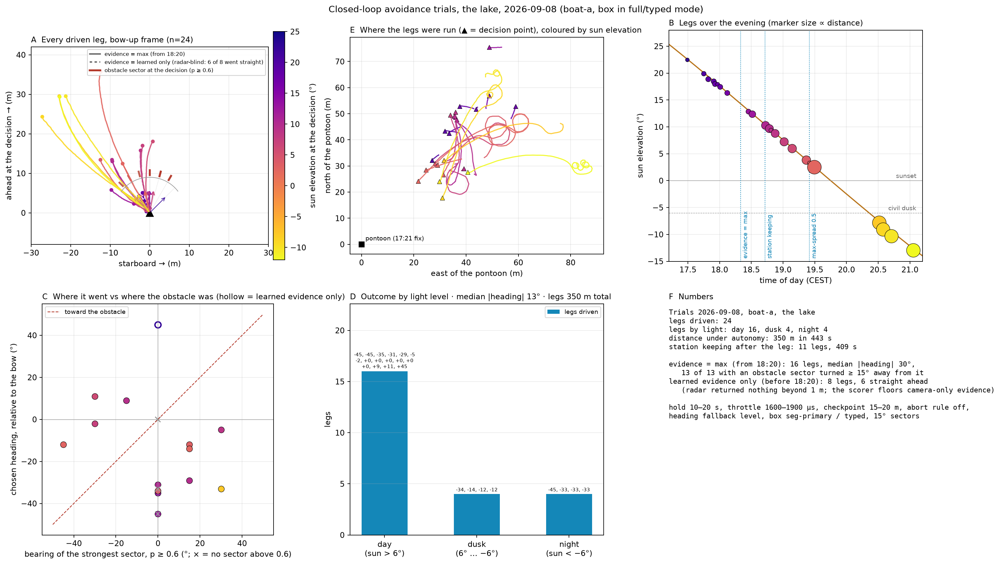
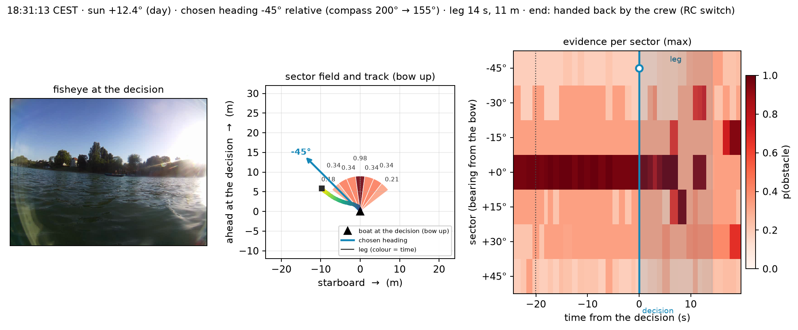
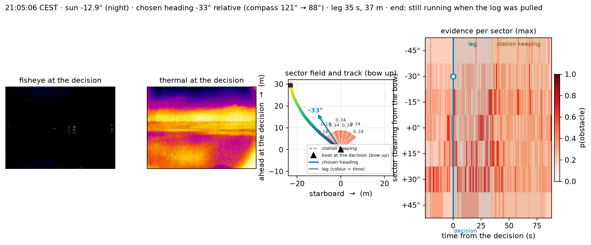

# ASV Marine Multimodal Obstacle Detection


ASV Marine Multimodal Obstacle Detection for an autonomous sailboat project (Institution One, a research center). A waterproof
sensor box on the boat records **fisheye RGB video, thermal (LWIR) video, and
mmWave radar point clouds with per-point Doppler**, plus attitude from an IMU
and RTC-backed timestamps. Offline, a fusion pipeline turns those into
per-bearing obstacle sectors (boats, swimmers, ducks, buoys, floating debris)
across day, night, and weather.

The target missions are week-long environmental data collections on the lake, where scene awareness and survivability decide whether a small
autonomous boat comes back.

**The sensor box is also usable as an RGB-only camera platform.** Every sensor is
independently switchable, so the same enclosure, capture service, and ingestion
tooling work with just the fisheye fitted; see
[Fisheye-only operation](#fisheye-only-operation).

---

## Contents

- [What is in this repository](#what-is-in-this-repository)
- [Supplementary Tables](#Supplementary-Tables)
- [Hardware](#hardware)
- [Install](#install)
- [Quickstart](#quickstart)
- [Fisheye-only operation](#fisheye-only-operation)
- [The Raspberry Pi](#the-raspberry-pi)
- [Repository layout](#repository-layout)
- [Data format](#data-format)
- [Processing pipeline](#processing-pipeline)
- [Testing](#testing)
- [Closed-loop trials](#closed-loop-trials)
- [Documentation](#documentation)
- [Project status](#project-status)
- [Authors](#authors)

---

## What is in this repository

- **Capture stack for the Raspberry Pi**: a systemd service recording
  synchronised rotating chunks from every fitted sensor, with per-sensor
  telemetry in the journal, plus smoke tests and health checks that gate a
  capture day.
- **The per-frame processing pipeline**: undistortion, horizon detection,
  per-sensor detection, radar Doppler and tracking, angular-bin fusion,
  time-to-collision, heading recommendation. Everything is configured in YAML,
  not by editing constants.
- **A learned water/sky/obstacle segmentation layer** (eWaSR trained on LaRS,
  distilled to an LRASPP student) giving waterline-contact range correction and
  a per-bearing navigable free-space profile, in **real time on the Pi 4** at
  4.6 fps via INT8 ONNX.
- **A learned fusion scorer**: a gradient-boosted, isotonic-calibrated per-sector
  obstacle probability over RGB, thermal and radar evidence plus acquisition
  context, trained on human-audited labels and evaluated session-disjoint
  (`scripts/fusion_model/`).
- **The perception-to-control chain**: a 46-byte sector packet over Bluetooth LE,
  and the closed-loop lake pilot that drove 24 legs on it (see
  [Closed-loop trials](#closed-loop-trials)).
- **An evaluation suite**: interactive dashboard, labelling and audit tools,
  quantitative metrics, parameter sweeps, range validation.
- **Audited labels** (`labels/`), CAD for the sensor mount, and the reference
  documentation (data formats, sector protocol, extrinsics, segmentation layer,
  on-box timing).


## Supplementary Tables

Sensor-suite power budgets, module bill of materials, and prototype hardware
configuration for the condition-conditioned RGB–thermal–radar obstacle
perception module.

### Table S1 — Illustrative sensing-plus-host-compute budgets

All values in watts (W), excluding auxiliary electronics and conversion losses.

**Sensor keys:** **R** = RGB camera · **T** = LWIR camera · **M** = compact
mmWave radar · **L** = compact 3-D LiDAR.

"Night" describes physical capability without an optical illuminator. Rain/fog
entries are qualitative design considerations. The first eight rows use the same
Raspberry Pi 4 compute allowance.

| Sensors | Unlit-night evidence | Rain/fog consideration | Sensing (W) | Compute (W) | Sum (W) |
|---|---|---|---:|---:|---:|
| R | Ambient light required | Optical contrast/visibility limited | 1.0–1.5 | 3–7 | 4.0–8.5 |
| T | Thermal contrast | Contrast, optics, and fog dependent | 0.3–1.0 | 3–7 | 3.3–8.0 |
| M | Range and Doppler | Useful non-optical channel; clutter/weak returns | 2–4 | 3–7 | 5–11 |
| R+T | Thermal channel | Both are optical; no weather guarantee | 1.3–2.5 | 3–7 | 4.3–9.5 |
| R+M | Radar channel | Radar complements degraded RGB | 3.0–5.5 | 3–7 | 6.0–12.5 |
| T+M | Thermal and radar | Complementary; validate joint failures | 2.3–5.0 | 3–7 | 5.3–12.0 |
| R+T+M | Thermal and radar | Candidate for wider operating coverage | 3.3–6.5 | 3–7 | 6.3–13.5 |
| R+L | LiDAR geometry | Optical attenuation/backscatter; active laser | 7.5–8.0 | 3–7 | 10.5–15.0 |
| R+T+M, accelerated | Thermal and radar | Same sensing; different compute budget | 3.3–6.5 | 9–30 | 12.3–36.5 |


Module power modes are not measured application consumption. All estimates
require validation at the chosen workloads; maxima are not worst-case
electrical specifications.


### Table S2 — Representative perception-module component costs

Quantity is one per row unless stated otherwise.

| Component | Cost (EUR) |
|---|---:|
| TI AWR1843BOOST radar | 410 |
| Raspberry Pi 4, 4 GB | 89 |
| FLIR Lepton 3.5 camera core | 136 |
| PureThermal 3 USB interface | 102 |
| RGB camera | 33 |
| BNO085 IMU breakout | 23 |
| **Total** | **793** |


### Table S3 — Prototype sensor-box configuration

Configuration used for onboard multimodal perception.

| Component | Configuration / output | Function in the pipeline |
|---|---|---|
| Fisheye RGB camera | 864 × 648 px; ~3 Hz; ~120° HFOV | Daylight semantics and obstacle segmentation. |
| FLIR Lepton 3.x | 160 × 120 px; ~3 Hz; ~57° HFOV | Thermal obstacle evidence under weak or absent illumination. |
| TI AWR1843BOOST | FMCW detections; range, azimuth, and Doppler; 9 m configured range | Illumination-independent geometric and motion evidence. |
| BNO085 IMU | Attitude and linear acceleration; 100 Hz | Horizon alignment and platform-motion context. |
| Raspberry Pi 4 | 64-bit ARM embedded computer | Acquisition, inference, health monitoring, and sector-map output. |
## Hardware

<p align="center">
  
</p>

<p align="center">
  
</p>

CAD for the 3D-printed mount is in [CAD/](CAD/); measured sensor offsets are in
[docs/reference/extrinsics.md](docs/reference/extrinsics.md).

---

## Install

### Development machine (laptop / workstation)

```bash
python3 -m venv .venv && source .venv/bin/activate
pip install -r requirements.txt -r requirements-dev.txt
python -m pytest -q          # 1,343 tests; the data-dependent ones skip without footage
```

Requires **Python 3.11+** (verified on 3.11 and 3.12). Dependency bounds are
floors, not pins.

Two optional extras are deliberately not installed; each is needed by one tool,
which says so and exits if it is missing:

```bash
pip install onnxruntime     # run segmentation locally (scripts.eval.local_seg_masks)
pip install scikit-learn    # the v1b GBT leg of the fusion-scorer bake-off
```

### Raspberry Pi

The Pi does **not** use a virtualenv: `picamera2` is not on PyPI, so the
capture stack runs on system apt packages. The apt package list, the
`config.txt` lines and the systemd unit are summarised under
[The Raspberry Pi](#the-raspberry-pi); the capture service is
`scripts/data_collection/continuous_capture.py`.

### GPU node

Model training and open-vocabulary labelling run on a GPU node via the
numbered pipelines in `scripts/gpu_express/` (one params file, prepare →
stage → launch → status → pull; see its README), with the older per-workflow
kits in `scripts/gpu_seg/`, `scripts/gpu_finetune/`, `scripts/gpu_dart/` and
`scripts/gpu_corpus/`. Requirements are in `requirements-gpu.txt` /
`requirements-gpu-seg.txt` and install on the node.

---

## Quickstart

With the environment active and footage in `data/`:

```bash
# Is everything wired up? Configs, every clip through the pipeline, full suite.
python -m scripts.eval.healthcheck

# End-to-end fusion over one clip -> a sectors JSONL stream.
python -m scripts.sensor_processing.fusion \
    --triplet data/Boats/2025-06-23_16-21-07 \
    --out results/sectors_boats.jsonl --track

# Interactive dashboard: any clip from a dropdown, per-bin sidebar,
# segmentation / detection / label overlay layers, labelling and audit modes.
python -m scripts.eval.dashboard
```

Every tool prints its own usage with `python -m scripts.<path> --help`; the
files the box writes and the pipeline reads are specified in
[docs/reference/data_formats.md](docs/reference/data_formats.md).

---

## Fisheye-only operation

The capture service does not assume the full sensor stack. A **disabled sensor
is never opened, never powered, and writes no file at all**, so a reduced
capture is an honest recording rather than a chunk with dead legs.

| Environment flag | Default | Set to `0`/`1` to |
|---|---|---|
| `ASVPROJECT_FISHEYE_ONLY` | `0` | `1` = fisheye (+ IMU) only: turns the radar **and** thermal off |
| `ASVPROJECT_RADAR_ENABLE` | `1` | `0` = no config push, no data port, no `mmwave_<ts>.csv` |
| `ASVPROJECT_THERMAL_ENABLE` | `1` | `0` = no V4L2 probe, no `thermal_<ts>.mp4` |
| `ASVPROJECT_IMU_ENABLE` | `1` | `0` = no IMU reader, no `imu_<ts>.csv` |

The IMU is independent of the vision set; it is not a camera and its draw is
negligible, so fisheye-only leaves it running.

**On the Pi**, smoke-test first, then run the service via the ready-made drop-in:

```bash
sudo systemctl stop asvproject-capture      # the tests must own the sensors
cd ~/ASVProject-ObstacleDetection

# Does the reduced capture path work? (radar/thermal report OFF, not FAIL)
python3 -m scripts.data_collection.smoke_capture --seconds 10 --fisheye-only

# Is the lighter load viable on this supply? Reports the under-voltage/throttle
# flags before vs after: PASS / WARN / FAIL.
python3 -m scripts.data_collection.smoke_fisheye --seconds 10

# Run the capture service fisheye-only (a systemd drop-in that sets the flag)
sudo systemctl edit asvproject-capture       # add: [Service] Environment=ASVPROJECT_FISHEYE_ONLY=1
sudo systemctl restart asvproject-capture
sudo systemctl revert asvproject-capture     # undo: back to the full stack
```

The journal states the sensor set at boot and on every chunk, so a reduced run
is never ambiguous:

```
[boot]  sensors: fisheye=on radar=OFF thermal=OFF imu=uart_rvc  [FISHEYE-ONLY]
[chunk] done 2026-08-05_10-14-00: 894 loops · thermal off · radar off · imu logged=880 …
```

**On the laptop**, fisheye-only captures are first-class through ingest and the
fisheye-only tools:

```bash
python -m scripts.data.ingest --source /tmp/pi_captures_<date> --mission <id>
#   OK  2026-08-05_10-14-00  [fisheye+frames+imu]      <- streams found, per capture

python -m scripts.eval.export_undistorted_frames --triplet data/captures/<id>/<ts>
python -m scripts.eval.local_seg_masks          --triplet data/captures/<id>/<ts>
```

Tools that *fuse* sensors (`scripts.sensor_processing.fusion`, the dashboard,
`scripts.eval.metrics`) still require a complete triplet and refuse a
fisheye-only clip by design: one sensor is not a fusion input.

> Fisheye-only is also the **reduced-power mode**: it stays under the supply's
> collapse threshold where the full stack does not, which makes it a useful
> diagnostic when a supply is suspect.

---

## The Raspberry Pi

The box as it ran the 2026-09-08 trials. Addresses are deliberately not
recorded here; the box is reached over a mesh VPN name rather than a DHCP
lease.

### Configuration snapshot

| | |
|---|---|
| Hostname / user | `SensorBox` / `vesselauser` (paths and the systemd unit assume this user) |
| Board | Raspberry Pi 4 Model B Rev 1.5 |
| OS | Raspberry Pi OS (Debian 13 trixie) **64-bit / arm64**, kernel `6.18.34+rpt-rpi-v8` |
| Python | system `python3`, apt packages, **no venv** |
| Access | SSH key-only (`PasswordAuthentication no`), passwordless sudo, Tailscale mesh |
| Network | Wi-Fi `campus-wifi` (NetworkManager, autoconnect priority 10) + eth0, both DHCP |
| Clock | external DS3231 I²C RTC: correct time offline, no NTP dependency |
| Capture service | `asvproject-capture.service`, 5-minute chunks to `~/captures/` |

`/boot/firmware/config.txt`, the load-bearing lines:

```ini
dtparam=i2c_arm=on            # I2C, for the external DS3231 RTC
dtparam=spi=on                # SPI: present, unused (abandoned SPI-IMU path)
enable_uart=1
dtoverlay=miniuart-bt         # PI-4 CRITICAL: stable PL011 on /dev/ttyAMA0 for the IMU; BT on the mini-UART
core_freq=500                 # miniuart-bt needs a pinned core clock (both lines)
core_freq_min=500
dtoverlay=i2c-rtc,ds3231      # external RTC (the Pi 4 has none built in)
camera_auto_detect=1
dtoverlay=vc4-kms-v3d
arm_64bit=1
arm_boost=1
```

Two traps that cost real sessions: on a Pi 4, GPIO14/15 default to the
*mini*-UART (`ttyS0`, baud-unstable): `dtoverlay=miniuart-bt` (+ the two
`core_freq` lines) is what gives you `ttyAMA0` while keeping the Bluetooth
radio for the sector link — `disable-bt` also works for the UART but switches
the radio off. And I²C enabled via `config.txt` does **not** auto-load `i2c-dev`, so
`/dev/i2c-1` is absent until you add it to `/etc/modules-load.d/`.

### On-Pi file tree

```text
/home/vesselauser/
├── ASVProject-ObstacleDetection/     rsync'd repo copy (NOT a git checkout)
│   ├── configs/                     detection.yaml, imu.yaml, gps.yaml, intrinsics.yaml, extrinsics.yaml
│   ├── deploy/                      pi_setup.sh, fisheye-only drop-in
│   └── scripts/
│       ├── data_collection/         continuous_capture.py, smoke_capture.py,
│       │                            smoke_fisheye.py, sensor_health.py, test_config*.cfg
│       ├── sensor_processing/       pipeline, fusion, imu_bno085, gps_boat1
│       └── utils/
├── captures/                        capture output (the rsync source)
│   ├── fisheye_<ts>.mp4   thermal_<ts>.mp4   mmwave_<ts>.csv
│   ├── imu_<ts>.csv       frames_<ts>.csv      gps_<ts>.csv
│   └── _smoketest/  _smoketest_fisheye/      throwaway smoke-test output
├── ewasr/                           ~516 MB: segmentation runtime
│   ├── student_512x384.int8.onnx        streaming tier (deployed default, 4.60 fps)
│   ├── student864t_864x648.int8.onnx    full-res tier (1.68 fps)
│   ├── ewasr_lars_*.int8.onnx           teacher ladder (fallback)
│   └── pi_seg_worker.py  pi_benchmark.py  pi_predict.py  sensor_health.py
├── test_config.cfg                  radar profile the service loads (CFAR 10 dB, clutterRemoval off)
├── test_config_clutter_on.cfg       clutterRemoval A/B variant
└── test_config_cfar{8,15}.cfg       CFAR sweep variants

/etc/systemd/system/
├── asvproject-capture.service        the capture service
├── asvproject-capture.service.d/     drop-in overrides (e.g. fisheye-only)
└── asvproject-bt-up.service          Bluetooth bring-up (BLE is now only the GPS fallback source)
```

---

## Repository layout

```text
.
├── CAD/                       3D-printable sensor-mount files
├── configs/                   Intrinsics, extrinsics, detection/fusion params, per-clip overrides
├── data/                      Recordings (gitignored)
│   ├── Boats/ Ducks/ OpenWater/ Rain/     scenario clips
│   └── captures/<mission>/                field captures, via scripts.data.ingest
├── dashboard/                 Web dashboard (Next.js): viewer, annotation, audit, coverage map
├── docs/reference/            Data formats, sector protocol, extrinsics, segmentation, on-box timing
├── images/                    README images, incl. closed_loop/ (2026-09-08 trial figures)
├── labels/                    Ground-truth JSONL (tracked) + versioned releases
├── models/                    Trained weights + ONNX exports (gitignored; published on Hugging Face)
├── scripts/
│   ├── data/                  Ingestion, frozen splits, dataset releases
│   ├── data_collection/       Pi capture service, smoke tests, sensor health, calibration capture
│   ├── eval/                  Dashboard, viewer, metrics, sweeps, labelling, range validation
│   ├── fusion_model/          Learned fusion scorer: features, targets, training, evaluation
│   ├── gpu_express/ gpu_corpus/ gpu_dart/ gpu_seg/ gpu_finetune/ gpu_labeling/
│   │                          GPU-node staging, training, labelling + Pi model runtime
│   ├── lars/                  LaRS dataset staging + YOLO converters
│   ├── sensor_processing/     Pipeline, fusion, motion, heading, trackers, IMU, GPS
│   └── utils/                 Calibration, geometry, segmentation, association, dataset helpers
└── tests/                     pytest suite (1,343 tests)
```

## Data format

One set of files per chunk, sharing a timestamp. **Only the fisheye is
mandatory**: a stream is present when its sensor was enabled and fitted:

```text
fisheye_<YYYY-MM-DD_HH-MM-SS>.mp4     864×648 @ ~3 fps        (always)
thermal_<YYYY-MM-DD_HH-MM-SS>.mp4     160×120 @ ~3 fps
mmwave_<YYYY-MM-DD_HH-MM-SS>.csv      radar points
imu_<YYYY-MM-DD_HH-MM-SS>.csv         attitude
frames_<YYYY-MM-DD_HH-MM-SS>.csv      per-frame RTC timestamps
gps_<YYYY-MM-DD_HH-MM-SS>.csv         own-boat position (~30 min cadence)
```

| File | Columns |
|---|---|
| `mmwave_*.csv` | `Date, Time, X, Y, Z, V, SNR, NOISE` |
| `imu_*.csv` | `Date, Time, Yaw, Pitch, Roll, Ax, Ay, Az` |
| `frames_*.csv` | `frame_index, Date, Time` |
| `gps_*.csv` | `Date, Time, Lat, Lon, Fix, Source, FixTime` |

`X/Y/Z` are metres in the radar frame (TI convention: X right, Y forward, Z up);
`V` is per-point radial Doppler in m/s (negative = approaching); `SNR`/`NOISE`
are per-point dB. Frames where the radar honestly saw nothing are written as
sentinel heartbeat rows (`Date,Time,,,,,,`), so a live-but-empty radar is
distinguishable from a dead one.

`gps_*.csv` is own-boat position for training metadata (sun geometry, offline
weather correlation) and never navigation: read at capture init and every
~30 min from **boat1's autopilot log**, which already records every fix, so
nothing on the boatv1 side has to be enabled. `Source` says where a row came
from — `boat_log` is a live fix, `fallback` is the fixed position configured in
`configs/gps.yaml` and is **not a measurement**, though its coordinates look
exactly like one.

Every column past `Z` is optional and readers treat it that way, so older
recordings load unchanged. Full schema, provenance, and the loader that owns
each file: **[docs/reference/data_formats.md](docs/reference/data_formats.md)**.
Never re-parse these by hand; use `scripts.utils.datasets`.

## Processing pipeline

The canonical per-frame pipeline is `scripts/sensor_processing/pipeline.py`
(undistortion → horizon → per-sensor detection → radar Doppler/tracking →
angular-bin fusion with per-bin time-to-collision), with the heading recommender
in `heading.py`. All parameters live in `configs/detection.yaml`.

Each sensor reduces what it sees to per-bearing-sector evidence, and a learned
context-gated scorer weighs those sensors against one another to produce a
calibrated per-sector obstacle probability. The gate is conditioned on onboard
context (sun position, image brightness, radar noise floor), the intent being
that each sensor is trusted where it is actually reliable:


That probability is the field the navigation controller steers by. On the
vessel the scorer runs as a separate process beside the capture service and
transmits a 46-byte sector packet over Bluetooth LE at up to 3 Hz
([docs/reference/sector_protocol.md](docs/reference/sector_protocol.md)); the
2026-09-08 lake pilot drove 24 legs on that stream
([Closed-loop trials](#closed-loop-trials)). What it cannot yet do is fuse at
true night: with the RGB frame black, the rule-based vote still ranks sectors
better than every learned variant on the audited night frames. See
[Project status](#project-status).

One dockside frame through the full stack: fisheye segmentation, thermal, radar
bird's-eye, and the learned scorer's per-sector probability, drawn over the
same 15° sectors the radar view uses. ▾ marks a **radar-confirmed detection**:
radar returns projected inside a camera detection's gate (equal ~4.3°
tolerance per camera: `fusion.association.max_px` / `thermal_max_px`), with
the mark placed on the sectors those matched returns actually occupy and only
when the detection's own sector is among them (`confirm_anchor` /
`confirm_same_bin`), so every ▾ is backed by radar evidence *in that
sector*: stronger than two sensors coincidentally voting together.


The learned segmentation layer supplies waterline-contact range correction and
the free-space profile; it is config-gated, and its Pi runtime (INT8 ONNX,
benchmark, async two-tier worker) is in `scripts/gpu_seg/`. It labels every pixel
water / sky / obstacle, so even obstacles the typed detector misses are still
flagged as "not water", and the waterline-contact point gives their range:


Trained models are published in the
[`hf-handle/asvproject-obstacle-detection`](https://huggingface.co/collections/hf-handle/asvproject-obstacle-detection-6a42591fe0f1a1866eb92083)
Hugging Face collection.

The output contract for the navigation layer is
[docs/reference/sector_protocol.md](docs/reference/sector_protocol.md).

The original single-sensor demos and one-shot capture scripts that this work
grew out of have been removed now that every one of them has a tested
replacement: the per-sensor algorithms live in `pipeline.py` and
`utils/cv_common.py`, capture is the `asvproject-capture` service, radar replay
is `scripts.eval.radar_video` and the dashboard, and fisheye calibration is
`fisheye_recalibrate.py`. They remain in the git history if you ever need to
compare against the originals.

## Testing

```bash
python -m pytest                                       # full suite (1,343 tests)
python -m pytest --cov=scripts --cov-report=term-missing --cov-report=html
ruff check .                                           # error-level lint
```

- The `data/` footage is large and not part of this snapshot. Tests needing real
  recordings are marked `needs_data` and **skip automatically** (see
  `tests/conftest.py`); the data-independent subset covers about 99% of the
  code.
- Intentionally excluded from coverage, because they cannot run off the boat:
  hardware I/O loops (`data_collection/`, `imu_bno085.py`), interactive GUI
  event loops, and GPU-node scripts. The list and its rationale are in
  `pyproject.toml` under `[tool.coverage.run]`.
- The lint gate is an **error** linter, not a style one: it fails on things
  that cannot be correct (undefined names, unreachable branches, broken format
  strings, mutable defaults), not on import order (`[tool.ruff]` in
  `pyproject.toml`).

`python -m scripts.eval.healthcheck` is the broader gate: configs, every clip
through the pipeline, and the test suite in one command.

## Closed-loop trials

On 2026-09-08 the chain box → Bluetooth LE sector stream → navigation
controller → rudder was run on the lake from daylight into night: **24 driven
legs (16 day, 4 dusk, 4 night), 350 m under autonomy**, with the crew's RC
switch as the only other control. Each launch holds station
for 10 to 20 s, takes the median sector field, chooses the least-obstructed
heading within ±45° (with a closeness penalty on radar returns inside 8 m) and
drives a 15 to 20 m checkpoint at low throttle. The figures are generated from
the boat's own decision logs by `scripts/eval/closed_loop_figures.py`
(`--legs-only`).



*A: every driven leg in the bow-up frame at the decision, coloured by sun
elevation, with the obstacle sector (p ≥ 0.6) marked. C: chosen heading against
the bearing of the strongest sector; nothing lies on the "toward the obstacle"
diagonal once the evidence rule was switched to the per-sector maximum of the
learned probability and the fused vote at 18:20 (the first eight legs, learned
probability alone, sent six of eight straight ahead because the scorer floors
camera-only evidence beyond the radar's 9 m). D/F: outcome by light level and
the numbers.*

One daytime decision in full (fisheye at the decision, sector field and track,
evidence per sector over the hold and the leg):



And one at night, with the RGB frame rejected as too dark and the heading chosen
on thermal and radar evidence alone:



Read the night legs narrowly: the learned probabilities were nearly flat there
(no sector above 0.34), so those headings followed small differences in the
radar-derived field rather than a confident obstacle estimate. That is the
open problem stated under [Project status](#project-status).

## Documentation

[docs/README.md](docs/README.md) indexes the reference set shipped with this
snapshot:

| | |
|---|---|
| [docs/reference/data_formats.md](docs/reference/data_formats.md) | Every on-disk stream the box writes and every feature table the scorer reads. |
| [docs/reference/sector_protocol.md](docs/reference/sector_protocol.md) | The per-frame sector contract the navigation layer consumes (JSONL and the 46-byte BLE packet). |
| [docs/reference/extrinsics.md](docs/reference/extrinsics.md) | Measured sensor offsets (photogrammetry, ±1 mm) and the remount table. |
| [docs/reference/segmentation.md](docs/reference/segmentation.md) | The LaRS/eWaSR water-segmentation layer and the distilled student: what they are trusted for. |
| [docs/reference/pi_timing.md](docs/reference/pi_timing.md) | On-box timing of every model, stage and configuration on the Pi 4, and the two throttles that corrupt naive benchmarks. |

The GPU-side workflows have their own READMEs under `scripts/gpu_*/`; the
dashboard has [dashboard/README.md](dashboard/README.md).

## Project status

Working and verified on hardware: the capture stack (all four sensors,
RTC-backed timestamps, reduced sensor sets), real-time segmentation on the Pi,
the offline fusion pipeline and evaluation suite, the on-vessel scorer with its
Bluetooth LE sector link (3 Hz in the radar+IMU configuration, 1.24 Hz with
segmentation beside capture on the boat supply), and the closed-loop pilot above.

Two things to know before relying on this:

- **Night fusion is the open problem.** Once the RGB frame is black
  (mean luminance below 25) the learned scorer must have its segmentation masks
  and pseudo-labels gated away, and on the audited night frames the rule-based
  vote (AP 0.58) still beats every learned variant (at most 0.52), while
  thermal-only and radar-only models recall far more of the persons. The
  controller therefore uses the per-sector maximum of the learned probability
  and the fused vote. More audited night frames with obstacles inside the
  radar's 9 m envelope are the prerequisite for a learned night model.
- **The pilot was slow and supervised.** Fixed low throttle, 15 to 20 m legs,
  the 4 m abort rule switched off after its first trigger on a moored boat, and
  the crew on the water with the RC switch. Speed above the slow throttle,
  moving obstacles, sail-driven legs and abort timing at real closing speeds
  are untested.

## Authors

- Primary author: Author Two
- Base work: Author Zero
- Project lead: Author One
- Institution: Institution One, a research centre
- Internship and funding: a funder 
