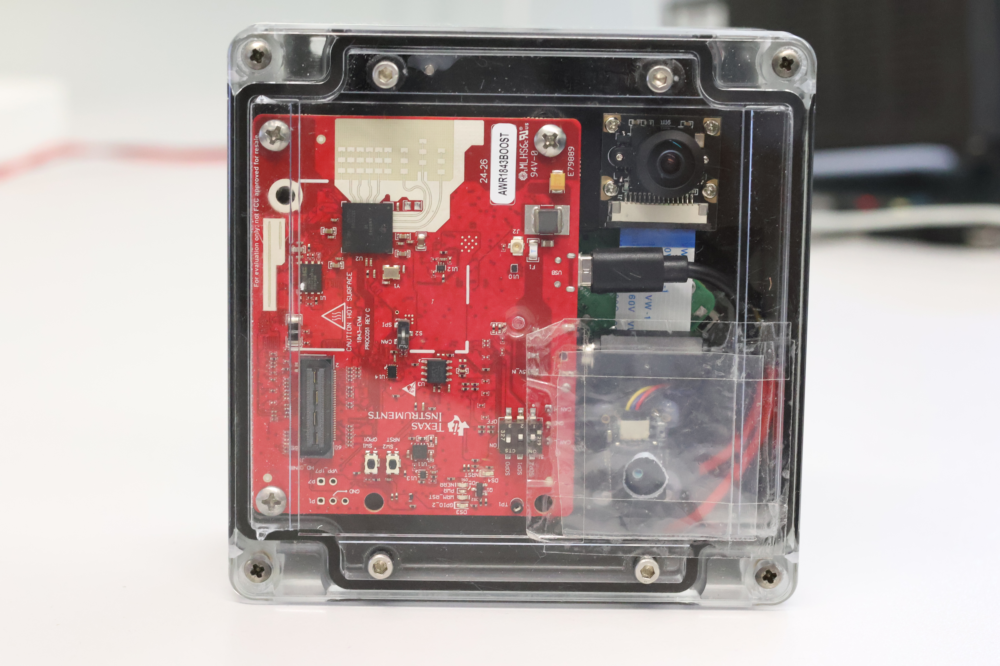
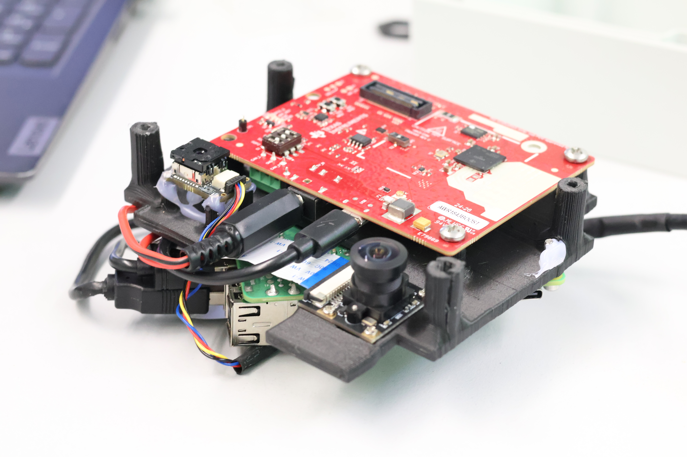
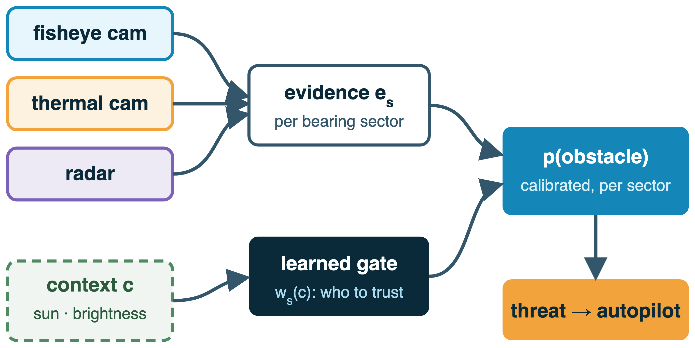
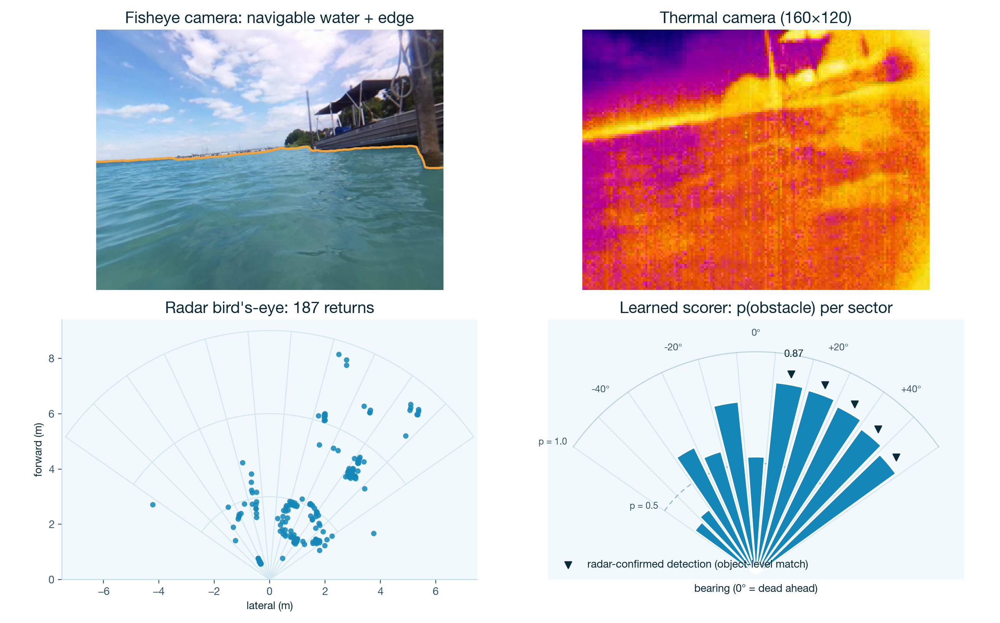
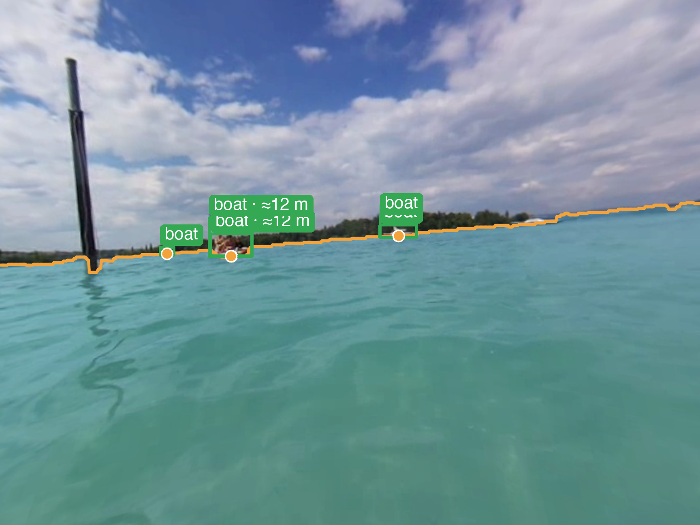

# ASV Marine Multimodal Obstacle Detection


ASV Marine Multimodal Obstacle Detection for an autonomous sailboat project (Institution One, a research center). A waterproof
sensor box on the boat records **fisheye RGB video, thermal (LWIR) video, and
mmWave radar point clouds with per-point Doppler**, plus attitude from an IMU
and RTC-backed timestamps. Offline, a fusion pipeline turns those into
per-bearing obstacle sectors (boats, swimmers, ducks, buoys, floating debris)
across day, night, and weather.

The target missions are week-long environmental data collections on the lake, where scene awareness and survivability decide whether a small
autonomous boat comes back.

**The sensor box is also usable as an RGB-only camera platform.** Every sensor is
independently switchable, so the same enclosure, capture service, and ingestion
tooling work with just the fisheye fitted; see
[Fisheye-only operation](#fisheye-only-operation).

---

## Contents

- [What is in this repository](#what-is-in-this-repository)
- [Hardware](#hardware)
- [Install](#install)
- [Quickstart](#quickstart)
- [Fisheye-only operation](#fisheye-only-operation)
- [The Raspberry Pi](#the-raspberry-pi)
- [Repository layout](#repository-layout)
- [Data format](#data-format)
- [Processing pipeline](#processing-pipeline)
- [Testing and continuous integration](#testing-and-continuous-integration)
- [Documentation](#documentation)
- [Project status](#project-status)
- [Authors](#authors)

---

## What is in this repository

- **Capture stack for the Raspberry Pi**: a systemd service recording
  synchronised rotating chunks from every fitted sensor, with per-sensor
  telemetry in the journal, plus smoke tests and health checks that gate a
  capture day.
- **The per-frame processing pipeline**: undistortion, horizon detection,
  per-sensor detection, radar Doppler and tracking, angular-bin fusion,
  time-to-collision, heading recommendation. Everything is configured in YAML,
  not by editing constants.
- **A learned water/sky/obstacle segmentation layer** (eWaSR trained on LaRS,
  distilled to an LRASPP student) giving waterline-contact range correction and
  a per-bearing navigable free-space profile, in **real time on the Pi 4** at
  4.6 fps via INT8 ONNX.
- **A learned fusion scorer** (phases 0–2) replacing hand-written vote counting
  with a per-bin probability conditioned on context.
- **An evaluation suite**: interactive dashboard, labelling and audit tools,
  quantitative metrics, parameter sweeps, range validation.
- **Field data**, CAD for the sensor mount, and the full operational
  documentation set.

## Hardware




| Component | Role |
|---|---|
| **Raspberry Pi 4 Model B** | Capture, logging, on-device segmentation. (A Pi 5 was tried and reverted; it browns out under sensor load on boat power.) |
| **RGB fisheye camera** (CSI, 864×648) | Daylight vision, ~120° usable horizontal FOV. The primary sensor. |
| **FLIR Lepton 3.0 / PureThermal** (160×120) | Night and low-visibility LWIR, ~57° HFOV. |
| **TI AWR1843BOOST mmWave radar** | Range + bearing + Doppler, ~9 m unambiguous range. |
| **BNO085 IMU** (UART-RVC) | Roll/pitch/yaw at 100 Hz: the horizon reference when vision fails. |
| **DS3231 RTC** | Correct timestamps with no network. |

CAD for the 3D-printed mount is in [CAD/](CAD/); measured sensor offsets are in
[docs/reference/extrinsics.md](docs/reference/extrinsics.md).

---

## Install

### Development machine (laptop / workstation)

```bash
git clone https://github.com/gh-handle-one/ASVProject-ObstacleDetection.git
cd ASVProject-ObstacleDetection
bash deploy/dev_setup.sh
```

That creates `.venv/`, installs [requirements.txt](requirements.txt) and
[requirements-dev.txt](requirements-dev.txt), verifies the imports and configs
load, and runs the test suite. Then activate it in each new shell:

```bash
source .venv/bin/activate
```

Prefer to do it by hand? The script is doing exactly this:

```bash
python3 -m venv .venv && source .venv/bin/activate
pip install -r requirements.txt -r requirements-dev.txt
python -m pytest -q
```

Requires **Python 3.11+** (CI runs 3.11 and 3.12). Dependency bounds are floors,
not pins; the suite is re-verified against current releases.

Two optional extras are deliberately not installed; each is needed by one tool,
which says so and exits if it is missing:

```bash
pip install onnxruntime     # run segmentation locally (scripts.eval.local_seg_masks)
pip install scikit-learn    # the v1b GBT leg of the fusion-scorer bake-off
```

### Raspberry Pi

The Pi does **not** use a virtualenv: `picamera2` is not on PyPI, so the
capture stack runs on system apt packages. After flashing the card and pushing
the repo:

```bash
bash deploy/pi_setup.sh
```

Full walkthrough, including the parts that need a human (imager settings,
wiring, Wi-Fi, Tailscale): **[docs/guides/pi_setup.md](docs/guides/pi_setup.md)**.

### GPU node

Model training and VLM labelling run on a InstTwo GPU node via the numbered
pipelines in `scripts/gpu_seg/`, `scripts/gpu_finetune/` and
`scripts/gpu_labeling/`; see
[docs/guides/gpu_nodes.md](docs/guides/gpu_nodes.md). Requirements are in
`requirements-gpu.txt` / `requirements-gpu-seg.txt` and install on the node.

---

## Quickstart

With the environment active and footage in `data/`:

```bash
# Is everything wired up? Configs, every clip through the pipeline, full suite.
python -m scripts.eval.healthcheck

# End-to-end fusion over one clip -> a sectors JSONL stream.
python -m scripts.sensor_processing.fusion \
    --triplet data/Boats/2025-06-23_16-21-07 \
    --out results/sectors_boats.jsonl --track

# Interactive dashboard: any clip from a dropdown, per-bin sidebar,
# segmentation / detection / label overlay layers, labelling and audit modes.
python -m scripts.eval.dashboard
```

Every command in the project (connecting to the Pi, capturing, syncing,
replaying, labelling, running models) is in
**[docs/field_reference.pdf](docs/field_reference.pdf)**, each with the files it
writes.

---

## Fisheye-only operation

The capture service does not assume the full sensor stack. A **disabled sensor
is never opened, never powered, and writes no file at all**, so a reduced
capture is an honest recording rather than a chunk with dead legs.

| Environment flag | Default | Set to `0`/`1` to |
|---|---|---|
| `ASVPROJECT_FISHEYE_ONLY` | `0` | `1` = fisheye (+ IMU) only: turns the radar **and** thermal off |
| `ASVPROJECT_RADAR_ENABLE` | `1` | `0` = no config push, no data port, no `mmwave_<ts>.csv` |
| `ASVPROJECT_THERMAL_ENABLE` | `1` | `0` = no V4L2 probe, no `thermal_<ts>.mp4` |
| `ASVPROJECT_IMU_ENABLE` | `1` | `0` = no IMU reader, no `imu_<ts>.csv` |

The IMU is independent of the vision set; it is not a camera and its draw is
negligible, so fisheye-only leaves it running.

**On the Pi**, smoke-test first, then run the service via the ready-made drop-in:

```bash
sudo systemctl stop asvproject-capture      # the tests must own the sensors
cd ~/ASVProject-ObstacleDetection

# Does the reduced capture path work? (radar/thermal report OFF, not FAIL)
python3 -m scripts.data_collection.smoke_capture --seconds 10 --fisheye-only

# Is the lighter load viable on this supply? Reports the under-voltage/throttle
# flags before vs after: PASS / WARN / FAIL.
python3 -m scripts.data_collection.smoke_fisheye --seconds 10

# Run the capture service fisheye-only (survives restarts; one command to undo)
sudo mkdir -p /etc/systemd/system/asvproject-capture.service.d
sudo cp deploy/asvproject-capture-fisheye-only.conf \
        /etc/systemd/system/asvproject-capture.service.d/override.conf
sudo systemctl daemon-reload && sudo systemctl restart asvproject-capture
sudo systemctl revert asvproject-capture    # undo: back to the full stack
```

The journal states the sensor set at boot and on every chunk, so a reduced run
is never ambiguous:

```
[boot]  sensors: fisheye=on radar=OFF thermal=OFF imu=uart_rvc  [FISHEYE-ONLY]
[chunk] done 2026-08-05_10-14-00: 894 loops · thermal off · radar off · imu logged=880 …
```

**On the laptop**, fisheye-only captures are first-class through ingest and the
fisheye-only tools:

```bash
python -m scripts.data.ingest --source /tmp/pi_captures_<date> --mission <id>
#   OK  2026-08-05_10-14-00  [fisheye+frames+imu]      <- streams found, per capture

python -m scripts.eval.export_undistorted_frames --triplet data/captures/<id>/<ts>
python -m scripts.eval.local_seg_masks          --triplet data/captures/<id>/<ts>
```

Tools that *fuse* sensors (`scripts.sensor_processing.fusion`, the dashboard,
`scripts.eval.metrics`) still require a complete triplet and refuse a
fisheye-only clip by design: one sensor is not a fusion input.

> Fisheye-only is also the **reduced-power mode**, which is what kept captures
> going through the 2026-07-16 boat-power blocker (closed 2026-08-14: the cause
> was reversed power and ground connections in the wiring, not the DC-DC
> converter). It remains useful as a low-draw mode and as a diagnostic when a
> supply is suspect:
> [docs/reference/power_and_supply.md](docs/reference/power_and_supply.md).

---

## The Raspberry Pi

Provisioning, verification, and the rebuild checklist:
**[docs/guides/pi_setup.md](docs/guides/pi_setup.md)**. Current addresses live in
[docs/field_reference.pdf](docs/field_reference.pdf): campus DHCP leases drift,
so prefer the Tailscale name.

### Configuration snapshot

| | |
|---|---|
| Hostname / user | `SensorBox` / `vesselauser` (paths and the systemd unit assume this user) |
| Board | Raspberry Pi 4 Model B Rev 1.5 |
| OS | Raspberry Pi OS (Debian 13 trixie) **64-bit / arm64**, kernel `6.18.34+rpt-rpi-v8` |
| Python | system `python3`, apt packages, **no venv** |
| Access | SSH key-only (`PasswordAuthentication no`), passwordless sudo, Tailscale mesh |
| Network | Wi-Fi `campus-wifi` (NetworkManager, autoconnect priority 10) + eth0, both DHCP |
| Clock | external DS3231 I²C RTC: correct time offline, no NTP dependency |
| Capture service | `asvproject-capture.service`, 5-minute chunks to `~/captures/` |

`/boot/firmware/config.txt`, the load-bearing lines:

```ini
dtparam=i2c_arm=on            # I2C, for the external DS3231 RTC
dtparam=spi=on                # SPI: present, unused (abandoned SPI-IMU path)
enable_uart=1
dtoverlay=miniuart-bt         # PI-4 CRITICAL: stable PL011 on /dev/ttyAMA0 for the IMU; BT on the mini-UART
core_freq=500                 # miniuart-bt needs a pinned core clock (both lines)
core_freq_min=500
dtoverlay=i2c-rtc,ds3231      # external RTC (the Pi 4 has none built in)
camera_auto_detect=1
dtoverlay=vc4-kms-v3d
arm_64bit=1
arm_boost=1
```

Two traps that cost real sessions: on a Pi 4, GPIO14/15 default to the
*mini*-UART (`ttyS0`, baud-unstable): `dtoverlay=miniuart-bt` (+ the two
`core_freq` lines) is what gives you `ttyAMA0` while keeping the Bluetooth
radio for the sector link — `disable-bt` also works for the UART but switches
the radio off. And I²C enabled via `config.txt` does **not** auto-load `i2c-dev`, so
`/dev/i2c-1` is absent until you add it to `/etc/modules-load.d/`.

### On-Pi file tree

```text
/home/vesselauser/
├── ASVProject-ObstacleDetection/     rsync'd repo copy (NOT a git checkout)
│   ├── configs/                     detection.yaml, imu.yaml, gps.yaml, intrinsics.yaml, extrinsics.yaml
│   ├── deploy/                      pi_setup.sh, fisheye-only drop-in
│   └── scripts/
│       ├── data_collection/         continuous_capture.py, smoke_capture.py,
│       │                            smoke_fisheye.py, sensor_health.py, test_config*.cfg
│       ├── sensor_processing/       pipeline, fusion, imu_bno085, gps_boat1
│       └── utils/
├── captures/                        capture output (the rsync source)
│   ├── fisheye_<ts>.mp4   thermal_<ts>.mp4   mmwave_<ts>.csv
│   ├── imu_<ts>.csv       frames_<ts>.csv      gps_<ts>.csv
│   └── _smoketest/  _smoketest_fisheye/      throwaway smoke-test output
├── ewasr/                           ~516 MB: segmentation runtime
│   ├── student_512x384.int8.onnx        streaming tier (deployed default, 4.60 fps)
│   ├── student864t_864x648.int8.onnx    full-res tier (1.68 fps)
│   ├── ewasr_lars_*.int8.onnx           teacher ladder (fallback)
│   └── pi_seg_worker.py  pi_benchmark.py  pi_predict.py  sensor_health.py
├── test_config.cfg                  radar profile the service loads (CFAR 10 dB, clutterRemoval off)
├── test_config_clutter_on.cfg       clutterRemoval A/B variant
└── test_config_cfar{8,15}.cfg       CFAR sweep variants

/etc/systemd/system/
├── asvproject-capture.service        the capture service
├── asvproject-capture.service.d/     drop-in overrides (e.g. fisheye-only)
└── asvproject-bt-up.service          Bluetooth bring-up (BLE is now only the GPS fallback source)
```

---

## Repository layout

```text
.
├── CAD/                       3D-printable sensor-mount files
├── configs/                   Intrinsics, extrinsics, detection/fusion params, per-clip overrides
├── data/                      Recordings (gitignored)
│   ├── Boats/ Ducks/ OpenWater/ Rain/     scenario clips
│   └── captures/<mission>/                field captures, via scripts.data.ingest
├── deploy/                    Provisioning: dev_setup.sh, pi_setup.sh, systemd drop-ins
├── docs/                      Documentation; see docs/README.md for the index
│   ├── guides/                living how-to (Pi setup, capture runbook, model runtime, GPU)
│   ├── reference/             stable specs (data formats, sector protocol, extrinsics, IMU, power)
│   ├── plans/                 agreed-but-unbuilt direction
│   └── history/               frozen dated session logs
├── images/                    README images
├── labels/                    Ground-truth JSONL (tracked) + versioned releases
├── models/                    Trained weights + ONNX exports (gitignored; published on Hugging Face)
├── scripts/
│   ├── data/                  Ingestion, frozen splits, dataset releases
│   ├── data_collection/       Pi capture service, smoke tests, sensor health, calibration capture
│   ├── eval/                  Dashboard, viewer, metrics, sweeps, labelling, range validation
│   ├── fusion_model/          Learned fusion scorer: features, targets, training, evaluation
│   ├── gpu_seg/ gpu_finetune/ gpu_labeling/    GPU-node training/labelling + Pi model runtime
│   ├── lars/                  LaRS dataset staging + YOLO converters
│   ├── sensor_processing/     Pipeline, fusion, motion, heading, trackers, IMU, GPS
│   └── utils/                 Calibration, geometry, segmentation, association, dataset helpers
└── tests/                     pytest suite (954 tests)
```

## Data format

One set of files per chunk, sharing a timestamp. **Only the fisheye is
mandatory**: a stream is present when its sensor was enabled and fitted:

```text
fisheye_<YYYY-MM-DD_HH-MM-SS>.mp4     864×648 @ ~3 fps        (always)
thermal_<YYYY-MM-DD_HH-MM-SS>.mp4     160×120 @ ~3 fps
mmwave_<YYYY-MM-DD_HH-MM-SS>.csv      radar points
imu_<YYYY-MM-DD_HH-MM-SS>.csv         attitude
frames_<YYYY-MM-DD_HH-MM-SS>.csv      per-frame RTC timestamps
gps_<YYYY-MM-DD_HH-MM-SS>.csv         own-boat position (~30 min cadence)
```

| File | Columns |
|---|---|
| `mmwave_*.csv` | `Date, Time, X, Y, Z, V, SNR, NOISE` |
| `imu_*.csv` | `Date, Time, Yaw, Pitch, Roll, Ax, Ay, Az` |
| `frames_*.csv` | `frame_index, Date, Time` |
| `gps_*.csv` | `Date, Time, Lat, Lon, Fix, Source, FixTime` |

`X/Y/Z` are metres in the radar frame (TI convention: X right, Y forward, Z up);
`V` is per-point radial Doppler in m/s (negative = approaching); `SNR`/`NOISE`
are per-point dB. Frames where the radar honestly saw nothing are written as
sentinel heartbeat rows (`Date,Time,,,,,,`), so a live-but-empty radar is
distinguishable from a dead one.

`gps_*.csv` is own-boat position for training metadata (sun geometry, offline
weather correlation) and never navigation: read at capture init and every
~30 min from **boat1's autopilot log**, which already records every fix, so
nothing on the boatv1 side has to be enabled. `Source` says where a row came
from — `boat_log` is a live fix, `fallback` is the fixed position configured in
`configs/gps.yaml` and is **not a measurement**, though its coordinates look
exactly like one.

Every column past `Z` is optional and readers treat it that way, so older
recordings load unchanged. Full schema, provenance, and the loader that owns
each file: **[docs/reference/data_formats.md](docs/reference/data_formats.md)**.
Never re-parse these by hand; use `scripts.utils.datasets`.

## Processing pipeline

The canonical per-frame pipeline is `scripts/sensor_processing/pipeline.py`
(undistortion → horizon → per-sensor detection → radar Doppler/tracking →
angular-bin fusion with per-bin time-to-collision), with the heading recommender
in `heading.py`. All parameters live in `configs/detection.yaml`.

Each sensor reduces what it sees to per-bearing-sector evidence, and a learned
context-gated scorer weighs those sensors against one another to produce a
calibrated per-sector obstacle probability. The gate is conditioned on onboard
context (sun position, image brightness, radar noise floor), the intent being
that each sensor is trusted where it is actually reliable:



That probability is the threat map the autopilot is meant to steer by. It is
**not** wired into navigation today: the scorer runs in shadow mode alongside
the rule-based score, and the weights come from a pre-data bake-off, so the
night and foul-weather behaviour the gate is designed for is still unproven.
See [Project status](#project-status).

One dockside frame through the full stack: fisheye segmentation, thermal, radar
bird's-eye, and the learned scorer's per-sector probability, drawn over the
same 10° sectors the radar view uses. ▾ marks a **radar-confirmed detection**:
radar returns projected inside a camera detection's gate (equal ~4.3°
tolerance per camera: `fusion.association.max_px` / `thermal_max_px`), with
the mark placed on the sectors those matched returns actually occupy and only
when the detection's own sector is among them (`confirm_anchor` /
`confirm_same_bin`), so every ▾ is backed by radar evidence *in that
sector*: stronger than two sensors coincidentally voting together.



The learned segmentation layer supplies waterline-contact range correction and
the free-space profile; it is config-gated, and its Pi runtime (INT8 ONNX,
benchmark, async two-tier worker) is in `scripts/gpu_seg/`. It labels every pixel
water / sky / obstacle, so even obstacles the typed detector misses are still
flagged as "not water", and the waterline-contact point gives their range:



Trained models are published in the
[`hf-handle/asvproject-obstacle-detection`](https://huggingface.co/collections/hf-handle/asvproject-obstacle-detection-6a42591fe0f1a1866eb92083)
Hugging Face collection.

The output contract for the navigation layer is
[docs/reference/sector_protocol.md](docs/reference/sector_protocol.md).

The original single-sensor demos and one-shot capture scripts that this work
grew out of have been removed now that every one of them has a tested
replacement: the per-sensor algorithms live in `pipeline.py` and
`utils/cv_common.py`, capture is the `asvproject-capture` service, radar replay
is `scripts.eval.radar_video` and the dashboard, and fisheye calibration is
`fisheye_recalibrate.py`. They remain in the git history if you ever need to
compare against the originals.

## Testing and continuous integration

```bash
python -m pytest                                       # full suite (969 tests)
python -m pytest --cov=scripts --cov-report=term-missing --cov-report=html
ruff check .                                           # error-level lint
shellcheck -S warning deploy/*.sh                      # the scripts you run
```

- The `data/` footage is large and gitignored, so it is absent on fresh clones.
  Tests needing real recordings are marked `needs_data` and **skip
  automatically** (see `tests/conftest.py`). The data-independent subset covers
  **~99% of the code**; CI enforces a 90% floor.
- Intentionally excluded from coverage, because they cannot run off the boat:
  hardware I/O loops (`data_collection/`, `imu_bno085.py`), interactive GUI
  event loops (`viewer.py`, `dashboard.py`, `thermal_calibrate.py`), and
  GPU/VLM node scripts. The list and its rationale are in `pyproject.toml`
  under `[tool.coverage.run]`.

Four workflows run on every push and pull request to `main`:

| Workflow | What it proves |
|---|---|
| **CI** (`ci.yml`) | The suite passes on Python 3.11 and 3.12, with the 90% coverage floor enforced. Uploads the HTML coverage report. |
| **Lint** (`lint.yml`) | `ruff` finds no error-level defects, `shellcheck` is clean (warning level for `deploy/`, error level everywhere), every shell script parses, every YAML loads. |
| **Docs** (`docs.yml`) | No dangling `docs/` or `deploy/` citation anywhere in the tree, no broken relative links, nothing missing from the index, and `field_reference.tex` still builds to a PDF. |
| **Pi compatibility** (`pi-compat.yml`) | The capture stack still imports and byte-compiles **without `picamera2`**, so the Pi-side code cannot break the laptop test suite. It also checks the sensor-enable flags resolve correctly. |

The lint gate is deliberately an **error** linter, not a style one: this is
research code, so it fails on things that cannot be correct (undefined names,
unreachable branches, broken format strings, mutable defaults) rather than on
import order. The rationale
and rule list are in `pyproject.toml` under `[tool.ruff]`.

`python -m scripts.eval.healthcheck` is the broader gate: configs, every clip
through the pipeline, and the test suite in one command.

## Documentation

Start at **[docs/README.md](docs/README.md)**: the full index. The four you are
most likely to want:

| | |
|---|---|
| [docs/field_reference.pdf](docs/field_reference.pdf) | Every operational command with the files it writes. Current Pi addresses. |
| [docs/guides/pi_setup.md](docs/guides/pi_setup.md) | Blank SD card → capturing box. |
| [docs/guides/capture_runbook.md](docs/guides/capture_runbook.md) | Capture-day gates, sensor sets, protocols, troubleshooting. |
| [docs/annotation_manual.pdf](docs/annotation_manual.pdf) | Labelling conventions and the audit workflow. |

## Project status

Working and verified on hardware: the capture stack (all four sensors,
RTC-backed timestamps, reduced sensor sets), real-time segmentation on the Pi,
the offline fusion pipeline, and the evaluation suite.

Two things to know before relying on this:

- **The fusion output is evaluation-grade and deliberately not wired into
  closed-loop navigation.** The segmentation-derived range and free-space
  outputs are replay-only until the fail-safe rules and the navigation-handoff
  protocol land.
- **Boat power: resolved 2026-08-14.** The long-running brownout traced to
  **reversed power and ground connections** in the wiring, caught by the current
  limiter with no damage, rather than to the DC-DC converter it was first
  attributed to. See
  [docs/reference/power_and_supply.md](docs/reference/power_and_supply.md);
  reassembly and bring-up in
  [docs/guides/box_reassembly.md](docs/guides/box_reassembly.md).

## Authors

- Primary author: Author Two
- Base work: Author Zero
- Project lead: Author One
- Institution: Institution One, a research centre
- Internship and funding: a funder 
